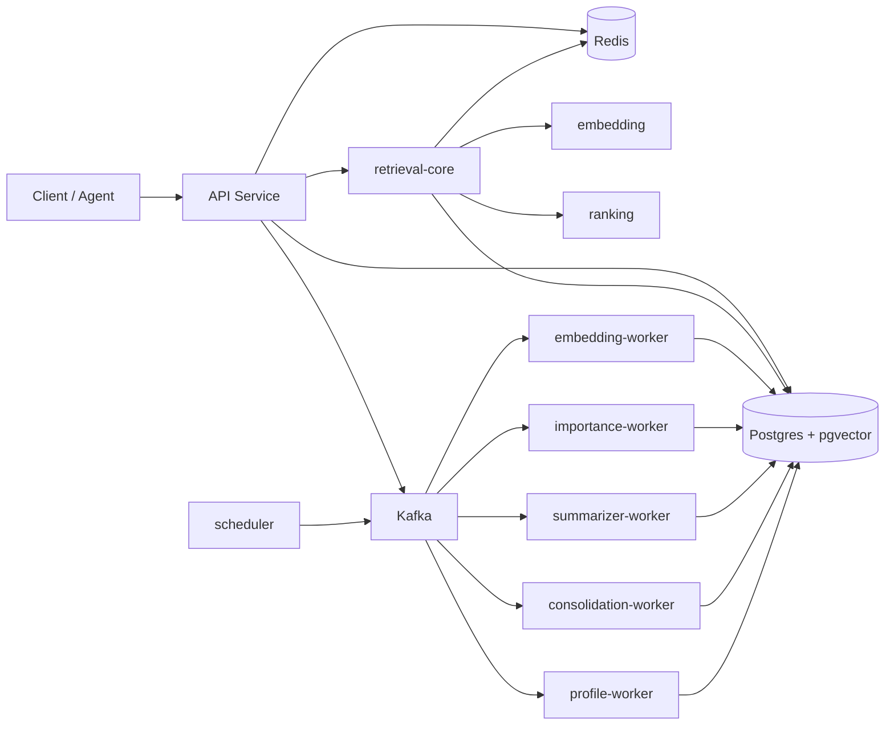

# Smriti

**Durable, queryable long-term memory for AI agents.**

Smriti (Sanskrit: *memory*) is a backend service that gives AI agents and applications persistent memory. It stores working, episodic, and semantic memories; generates embeddings and importance scores; consolidates duplicates; summarizes user history; and serves low-latency context for retrieval-augmented generation (RAG).

[](https://nodejs.org/)
[](https://www.typescriptlang.org/)
[](https://pnpm.io/)
[](https://nx.dev/)
[](https://opensource.org/licenses/MIT)

---

## Features

- **Three memory tiers** — working (Redis, session-scoped), episodic (discrete events), and semantic (durable facts with vector embeddings)
- **Synchronous RAG retrieval** — `POST /memories/context` returns ranked, cache-aware context without touching Kafka
- **Async enrichment pipeline** — Kafka workers handle embedding, importance scoring, summarization, consolidation, and user profiling off the request path
- **Vector search** — Postgres + pgvector for similarity search in a single datastore
- **Production-oriented design** — thin deployable apps, rich domain libraries, enforced Nx module boundaries, idempotent consumers with retries and DLQs
- **Observability** — OpenTelemetry traces, Prometheus metrics, and Grafana dashboards

## Architecture



**Write path:** client creates a memory → API persists it → `memory-created` event published → workers enrich asynchronously.

**Read path:** client queries context → API runs the retrieval pipeline synchronously (cache → embed → search → rank → build).

See [docs/architecture/ai-memory-service-architecture.md](docs/architecture/ai-memory-service-architecture.md) for the full design.

## Tech stack

| Layer | Choice |
| --- | --- |
| Monorepo | Nx + pnpm |
| Language | TypeScript (strict) |
| HTTP | NestJS + Fastify |
| SQL | Kysely + Postgres + pgvector |
| Cache | Redis |
| Messaging | Kafka |
| Telemetry | OpenTelemetry, Prometheus, Grafana |

## Project structure

```text
smriti/
├── apps/
│   ├── api/                    # HTTP API — create, list, delete, retrieve context
│   ├── embedding-worker/       # Generate and persist embeddings
│   ├── importance-worker/      # Score memory importance
│   ├── summarizer-worker/      # Rolling user history summaries
│   ├── consolidation-worker/   # Merge near-duplicate memories
│   ├── profile-worker/         # Structured user profiles
│   └── scheduler/              # Periodic jobs (decay, cleanup, summarize)
├── libs/
│   ├── memory-core/            # Domain entities and use cases
│   ├── retrieval-core/         # Retrieval orchestration pipeline
│   ├── ranking/                # Pure ranking/scoring functions
│   ├── embedding/              # EmbeddingProvider abstraction
│   ├── postgres/               # Kysely repositories and migrations
│   ├── redis/                  # Working memory and context cache
│   ├── kafka/                  # Producer, consumer runtime, retry/DLQ
│   ├── events/                 # Versioned event contracts
│   ├── auth/                   # Principal resolution
│   ├── observability/          # Logger, metrics, tracing
│   ├── config/                 # Validated environment configuration
│   ├── shared-types/           # Shared DTOs
│   └── testing/                # Fixtures and test harnesses
├── infra/docker/               # Docker Compose for local development
└── docs/
    ├── architecture/           # System design documents
    └── local-development-runbook.md
```

## Prerequisites

| Tool | Version |
| --- | --- |
| Node.js | >= 20 |
| pnpm | 11.7.0 |
| Docker Desktop | Running |

On Windows, Git Bash or WSL is recommended for loading `.env`.

## Quick start

### 1. Install and configure

```bash
pnpm install
cp .env.example .env
```

The default `.env` targets local Docker services. Postgres listens on host port **55432** (not 5432) to avoid conflicts with a local Postgres install.

### 2. Start infrastructure

```bash
pnpm infra:up
```

Wait ~10 seconds for Kafka to become ready, then confirm containers are healthy:

```bash
docker compose -f infra/docker/docker-compose.yml ps
```

| Service | Host port | Purpose |
| --- | --- | --- |
| Postgres (pgvector) | 55432 | Primary datastore + vectors |
| Redis | 6379 | Working memory + context cache |
| Kafka | 9092 | Event bus for workers |
| Prometheus | 9090 | Metrics |
| Grafana | 3001 | Dashboards (`admin` / `admin`) |
| OTel Collector | 4317, 4318 | Traces and metrics export |

### 3. Migrate and seed a test user

```bash
# Git Bash / WSL / macOS / Linux
set -a && source .env && set +a && pnpm db:migrate
```

```powershell
# PowerShell
Get-Content .env | ForEach-Object {
  if ($_ -match '^\s*([^#][^=]+)=(.*)$') { Set-Item -Path "env:$($matches[1])" -Value $matches[2] }
}
pnpm db:migrate
```

Memories reference `users.id`. Seed a dev user once:

```bash
docker exec smriti-postgres-1 psql -U smriti -d smriti -c \
  "INSERT INTO users (id, name) VALUES ('22222222-2222-2222-2222-222222222222', 'Local Dev') ON CONFLICT DO NOTHING;"
```

### 4. Start the API and workers

In separate terminals (load `.env` in each):

```bash
set -a && source .env && set +a && pnpm dev:api
```

```bash
set -a && source .env && set +a && pnpm dev:workers
```

### 5. Verify

```bash
curl http://localhost:3000/health/live
curl http://localhost:3000/health/ready
```

Expected:

```json
{"status":"ok"}
{"status":"ok","dependencies":{"postgres":true,"redis":true}}
```

For a full walkthrough, smoke tests, and troubleshooting, see [docs/local-development-runbook.md](docs/local-development-runbook.md).

## API

All authenticated endpoints require the `x-user-id` header (UUID). API key checks via `x-api-key` are optional in development.

| Method | Path | Description |
| --- | --- | --- |
| `POST` | `/memories` | Create a memory (returns `202`) |
| `POST` | `/memories/context` | Retrieve ranked RAG context for a query |
| `GET` | `/users/:id/memories` | List memories for a user |
| `DELETE` | `/memories/:id` | Delete a memory |
| `GET` | `/health/live` | Liveness probe |
| `GET` | `/health/ready` | Readiness probe (Postgres, Redis) |
| `GET` | `/metrics` | Prometheus metrics |

### Create a memory

```bash
curl -X POST http://localhost:3000/memories \
  -H "Content-Type: application/json" \
  -H "x-user-id: 22222222-2222-2222-2222-222222222222" \
  -d '{
    "type": "semantic",
    "content": "I am a backend engineer learning Kafka"
  }'
```

Memory types: `working`, `episodic`, `semantic`.

### Retrieve context

```bash
curl -X POST http://localhost:3000/memories/context \
  -H "Content-Type: application/json" \
  -H "x-user-id: 22222222-2222-2222-2222-222222222222" \
  -d '{
    "query": "What is the user learning?",
    "limit": 5
  }'
```

Allow a few seconds after creating a memory for the embedding worker to process it before querying context.

### List memories

```bash
curl "http://localhost:3000/users/22222222-2222-2222-2222-222222222222/memories" \
  -H "x-user-id: 22222222-2222-2222-2222-222222222222"
```

## Environment variables

| Variable | Default | Description |
| --- | --- | --- |
| `NODE_ENV` | `development` | Runtime environment |
| `HTTP_HOST` | `0.0.0.0` | API bind address |
| `HTTP_PORT` | `3000` | API port |
| `POSTGRES_URL` | — | Postgres connection string |
| `POSTGRES_POOL_SIZE` | `10` | Connection pool size |
| `REDIS_URL` | — | Redis connection string |
| `KAFKA_BROKERS` | — | Comma-separated broker list |
| `KAFKA_CLIENT_ID` | `smriti` | Kafka client ID |
| `KAFKA_GROUP_ID` | `smriti-workers` | Consumer group ID |
| `EMBEDDING_PROVIDER` | `mock` | `mock` or `openai` |
| `EMBEDDING_MODEL` | `text-embedding-3-small` | OpenAI embedding model |
| `EMBEDDING_DIMENSIONS` | `1536` | Vector dimensions |
| `OPENAI_API_KEY` | — | Required when `EMBEDDING_PROVIDER=openai` |
| `OTEL_EXPORTER_OTLP_ENDPOINT` | `http://localhost:4318` | OTLP exporter URL |
| `OTEL_SERVICE_NAME` | `smriti` | Service name for telemetry |

Copy `.env.example` as a starting point.

## Development

| Command | Description |
| --- | --- |
| `pnpm dev:api` | Start API with hot reload |
| `pnpm dev:workers` | Start all workers and scheduler |
| `pnpm infra:up` | Start Docker infrastructure |
| `pnpm infra:down` | Stop Docker infrastructure |
| `pnpm db:migrate` | Apply pending SQL migrations |
| `pnpm build` | Build all apps |
| `pnpm typecheck` | Typecheck all projects |
| `pnpm lint` | Lint all projects |
| `pnpm test` | Run unit tests |
| `pnpm graph` | Open Nx dependency graph |

Individual workers can be started with `pnpm dev:embedding-worker`, `pnpm dev:importance-worker`, and so on.

### Reset local data

```bash
docker compose -f infra/docker/docker-compose.yml down -v
pnpm infra:up
set -a && source .env && set +a && pnpm db:migrate
# Re-seed the test user
```

## Documentation

| Document | Contents |
| --- | --- |
| [Local development runbook](docs/local-development-runbook.md) | Step-by-step setup, smoke tests, troubleshooting |
| [System architecture](docs/architecture/ai-memory-service-architecture.md) | Topology, design principles, component map |
| [Database design](docs/architecture/database-design.md) | Schemas and storage model |
| [Retrieval pipeline](docs/architecture/retrieval-pipeline-design.md) | Context retrieval flow |
| [Event-driven design](docs/architecture/event-driven-design.md) | Kafka topics, workers, idempotency |
| [Observability](docs/architecture/observability-design.md) | Metrics, traces, health checks |
| [Development roadmap](docs/architecture/development-roadmap.md) | Phased delivery plan |

## License

MIT
