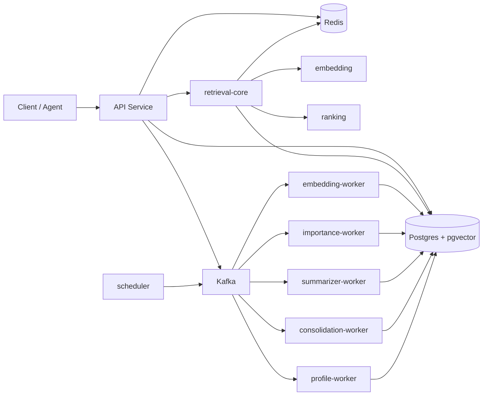
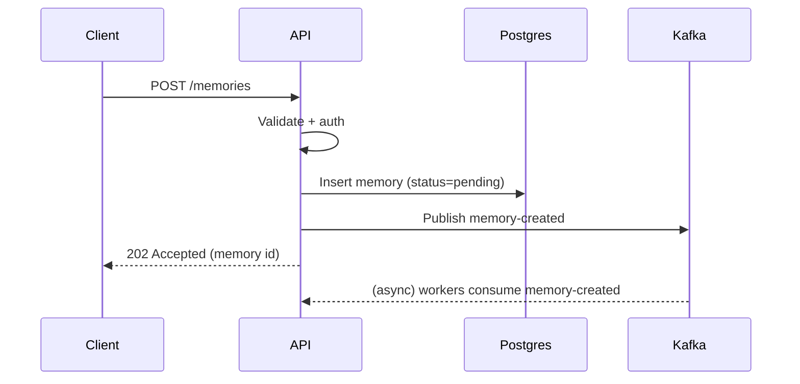

# AI Memory Service - System Architecture

## Purpose

The AI Memory Service (codename `smriti`) is a backend-heavy platform that gives
AI agents and applications a durable, queryable long-term memory. It stores raw
memories, derives embeddings and importance scores, consolidates duplicates,
summarizes history, and serves low-latency context for retrieval-augmented
generation (RAG).

The system is optimized for seven engineering qualities: maintainability,
scalability, reliability, testability, extensibility, observability, and
security.

## High-Level Topology

## Core Design Principles

1. **Thin apps, rich libraries.** Apps (`apps/*`) are deployable entry points
   that wire together transport (HTTP, Kafka consumers, cron) and delegate all
   business rules to libraries (`libs/*`).
2. **Domain vs infrastructure separation.** Domain libraries (`memory-core`,
   `retrieval-core`, `ranking`) contain pure logic with no I/O. Infrastructure
   libraries (`postgres`, `redis`, `kafka`, `embedding`) implement adapters
   behind interfaces the domain owns.
3. **Synchronous reads, asynchronous writes-side processing.** User-facing
   retrieval (`POST /memories/context`) is synchronous and latency-bound. Heavy
   work (embedding, scoring, summarizing, consolidation, profiles) happens in
   Kafka workers off the request path.
4. **Contracts are explicit and versioned.** Event payloads and shared DTOs live
   in `libs/events` and `libs/shared-types` so producers and consumers evolve
   safely.
5. **No circular dependencies.** Enforced by Nx module-boundary lint rules.

## Component Responsibilities

| Component                   | Type          | Responsibility                                                                     |
| --------------------------- | ------------- | ---------------------------------------------------------------------------------- |
| `apps/api`                  | App           | HTTP API, auth, validation, orchestration, synchronous retrieval, event publishing |
| `apps/embedding-worker`     | App           | Generate and persist embeddings for new memories                                   |
| `apps/importance-worker`    | App           | Score memory importance                                                            |
| `apps/summarizer-worker`    | App           | Produce rolling summaries of user history                                          |
| `apps/consolidation-worker` | App           | Merge duplicate/near-duplicate semantic memories                                   |
| `apps/profile-worker`       | App           | Generate structured user profiles                                                  |
| `apps/scheduler`            | App           | Emit periodic jobs (decay, cleanup, summarize, profile)                            |
| `libs/memory-core`          | Domain        | Memory entities, value objects, use cases                                          |
| `libs/retrieval-core`       | Domain        | Retrieval orchestration pipeline                                                   |
| `libs/ranking`              | Domain        | Pure ranking/scoring functions                                                     |
| `libs/embedding`            | Infra         | `EmbeddingProvider` abstraction + implementations                                  |
| `libs/postgres`             | Infra         | Connection pool, migrations, repositories (Kysely)                                 |
| `libs/redis`                | Infra         | Working memory + context cache                                                     |
| `libs/kafka`                | Infra         | Producer, consumer runtime, retry/DLQ helpers                                      |
| `libs/events`               | Contract      | Versioned event names + payload schemas                                            |
| `libs/auth`                 | Cross-cutting | Auth guards, principal/user context                                                |
| `libs/observability`        | Cross-cutting | Logger, metrics, tracing bootstrap                                                 |
| `libs/config`               | Cross-cutting | Validated environment configuration                                                |
| `libs/shared-types`         | Contract      | Dependency-light shared types/DTOs                                                 |
| `libs/testing`              | Tooling       | Fixtures, fakes, test harnesses                                                    |

## Memory Model

Three memory categories, each backed by the storage best suited to it:

- **Working memory** - current conversation turns, stored in Redis with a 24h
  TTL. Ephemeral and session-scoped.
- **Episodic memory** - discrete events ("user deployed service"), stored in
  Postgres.
- **Semantic memory** - durable facts ("user knows Node.js"), stored in Postgres
  with a pgvector embedding for similarity search.

See `database-design.md` for schemas and `retrieval-pipeline-design.md` for how
these are combined at query time.

## Request and Event Flows

### Write path (create memory)

### Read path (retrieve context)

The read path never depends on Kafka. It is fully synchronous and cache-aware.
See `retrieval-pipeline-design.md`.

## Technology Choices

| Concern                | Choice                               | Rationale                                                 |
| ---------------------- | ------------------------------------ | --------------------------------------------------------- |
| Monorepo               | Nx + pnpm                            | Project graph, affected builds, enforced boundaries       |
| Language               | TypeScript (strict)                  | Type safety across services and contracts                 |
| HTTP framework         | NestJS + Fastify adapter             | Structured DI, modules, high throughput                   |
| SQL access             | Kysely                               | Explicit SQL with strong type safety, easy pgvector usage |
| Vector store           | Postgres + pgvector                  | One datastore for facts and vectors                       |
| Cache / working memory | Redis                                | Low-latency TTL storage                                   |
| Messaging              | Kafka                                | Durable, partitioned, replayable event log                |
| Telemetry              | OpenTelemetry + Prometheus + Grafana | Traces, metrics, dashboards                               |

## Deployment Shape

Every app is independently buildable and containerizable. Local development uses
Docker Compose (`infra/docker`) to run Postgres, Redis, Kafka, Prometheus,
Grafana, and the OpenTelemetry Collector. See `observability-design.md`.

## Related Documents

- `low-level-design.md` - module-level design and interfaces
- `database-design.md` - schemas, indexes, migrations
- `event-driven-design.md` - topics, payloads, delivery semantics
- `retrieval-pipeline-design.md` - the synchronous retrieval pipeline
- `observability-design.md` - logs, metrics, traces, dashboards
- `development-roadmap.md` - phased delivery plan
