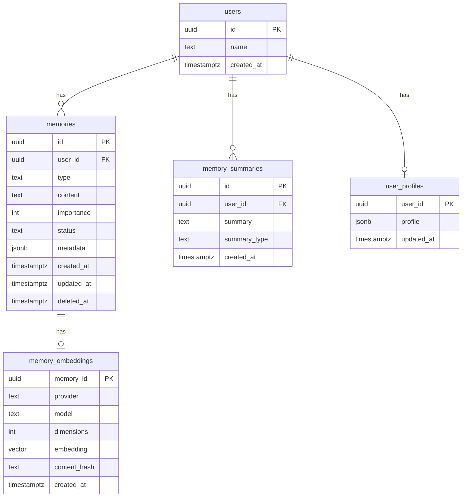

# Database Design

PostgreSQL is the system of record for episodic and semantic memory, embeddings,
summaries, and user profiles. The `pgvector` extension provides vector
similarity search. Redis handles ephemeral working memory and caching (covered
in `retrieval-pipeline-design.md`).

## Conventions

- Primary keys are UUID (`uuid` type), generated by the application.
- All timestamps are `timestamptz`, stored in UTC.
- Soft deletion uses a nullable `deleted_at`; queries filter `deleted_at IS NULL`.
- Flexible attributes use `jsonb`.
- Migrations are forward-only SQL files in `libs/postgres/migrations`, applied in
  lexicographic order and tracked in a `schema_migrations` table.

## Entity Relationships



## Tables

### users

```sql
CREATE TABLE users (
  id          UUID PRIMARY KEY,
  name        TEXT,
  created_at  TIMESTAMPTZ NOT NULL DEFAULT now()
);
```

### memories

```sql
CREATE TABLE memories (
  id          UUID PRIMARY KEY,
  user_id     UUID NOT NULL REFERENCES users(id),
  type        TEXT NOT NULL CHECK (type IN ('working','episodic','semantic')),
  content     TEXT NOT NULL,
  importance  INTEGER NOT NULL DEFAULT 0,
  status      TEXT NOT NULL DEFAULT 'pending'
                CHECK (status IN ('pending','active','archived','deleted')),
  metadata    JSONB NOT NULL DEFAULT '{}'::jsonb,
  created_at  TIMESTAMPTZ NOT NULL DEFAULT now(),
  updated_at  TIMESTAMPTZ NOT NULL DEFAULT now(),
  deleted_at  TIMESTAMPTZ
);

CREATE INDEX idx_memories_user_active
  ON memories (user_id, created_at DESC)
  WHERE deleted_at IS NULL;

CREATE INDEX idx_memories_status ON memories (status);
```

### memory_embeddings

Embedding dimensions vary per provider/model, so `dimensions` is tracked
explicitly. `content_hash` enables idempotency: a worker can skip regenerating an
embedding when content is unchanged.

```sql
CREATE TABLE memory_embeddings (
  memory_id     UUID PRIMARY KEY REFERENCES memories(id) ON DELETE CASCADE,
  provider      TEXT NOT NULL,
  model         TEXT NOT NULL,
  dimensions    INTEGER NOT NULL,
  embedding     VECTOR(1536) NOT NULL,
  content_hash  TEXT NOT NULL,
  created_at    TIMESTAMPTZ NOT NULL DEFAULT now()
);

CREATE INDEX idx_memory_embeddings_ann
  ON memory_embeddings
  USING hnsw (embedding vector_cosine_ops);
```

> Note: the column is declared `VECTOR(1536)` to match the default model. If you
> standardize on a different dimensionality, change the migration accordingly.
> The `dimensions` column guards against mixing incompatible vectors.

### memory_summaries

```sql
CREATE TABLE memory_summaries (
  id            UUID PRIMARY KEY,
  user_id       UUID NOT NULL REFERENCES users(id),
  summary       TEXT NOT NULL,
  summary_type  TEXT NOT NULL DEFAULT 'rolling',
  created_at    TIMESTAMPTZ NOT NULL DEFAULT now()
);

CREATE INDEX idx_memory_summaries_user ON memory_summaries (user_id, created_at DESC);
```

### user_profiles

```sql
CREATE TABLE user_profiles (
  user_id     UUID PRIMARY KEY REFERENCES users(id),
  profile     JSONB NOT NULL DEFAULT '{}'::jsonb,
  updated_at  TIMESTAMPTZ NOT NULL DEFAULT now()
);
```

### schema_migrations

```sql
CREATE TABLE schema_migrations (
  name        TEXT PRIMARY KEY,
  applied_at  TIMESTAMPTZ NOT NULL DEFAULT now()
);
```

## Vector Search Query

Cosine distance with pgvector (`<=>`), filtered to the requesting user and live
rows:

```sql
SELECT m.id, m.content, m.importance, m.created_at,
       1 - (e.embedding <=> $1) AS similarity
FROM memory_embeddings e
JOIN memories m ON m.id = e.memory_id
WHERE m.user_id = $2
  AND m.deleted_at IS NULL
  AND m.status = 'active'
ORDER BY e.embedding <=> $1
LIMIT $3;
```

## Access Layer

All queries are written with Kysely against generated database types. Repository
classes in `libs/postgres` implement the ports declared by the domain layer
(`MemoryRepository`, `VectorSearchPort`, etc.). The raw pgvector operators are
issued via Kysely's `sql` template tag where the query builder lacks native
support.

## Migration Workflow

1. Add a new SQL file: `libs/postgres/migrations/NNNN_description.sql`.
2. Run the migrator (`pnpm nx run postgres:migrate`), which applies pending files
   inside a transaction and records them in `schema_migrations`.
3. Migrations are forward-only; corrections are new migrations, never edits to
   applied files.
