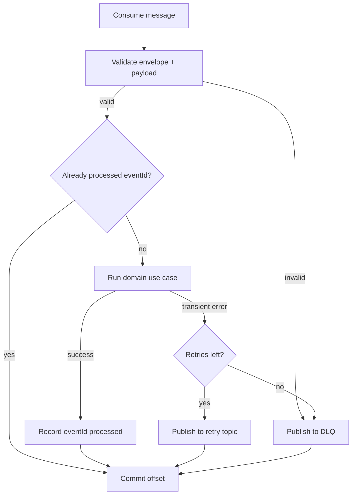

# Event-Driven Design

Kafka decouples the synchronous write path from expensive background processing.
The API persists a memory and publishes an event; workers react asynchronously.
User-facing retrieval never depends on Kafka.

## Topics

| Topic                 | Produced by          | Consumed by                         | Purpose                              |
| --------------------- | -------------------- | ----------------------------------- | ------------------------------------ |
| `memory-created`      | api                  | embedding-worker, importance-worker | New memory needs embedding + scoring |
| `memory-updated`      | api                  | embedding-worker                    | Content changed; re-embed            |
| `memory-deleted`      | api                  | embedding-worker, profile-worker    | Propagate deletion                   |
| `embedding-generated` | embedding-worker     | (analytics, future)                 | Embedding persisted                  |
| `memory-scored`       | importance-worker    | (analytics, future)                 | Importance updated                   |
| `summary-generated`   | summarizer-worker    | profile-worker                      | New summary available                |
| `profile-generated`   | profile-worker       | (analytics, future)                 | Profile updated                      |
| `memory-consolidated` | consolidation-worker | (analytics, future)                 | Duplicates merged                    |

Each topic has a companion retry and dead-letter topic:

```text
<topic>            // main
<topic>.retry      // delayed reprocessing
<topic>.dlq        // poison messages, manual inspection
```

## Event Envelope

All events share a versioned envelope defined in `libs/events`:

```ts
export interface EventEnvelope<TName extends string, TPayload> {
  eventId: string; // unique, used for idempotency
  eventName: TName; // e.g. 'memory-created'
  version: number; // schema version
  occurredAt: string; // ISO timestamp
  partitionKey: string; // userId, for ordering per user
  payload: TPayload;
}
```

Example payload:

```ts
export interface MemoryCreatedPayload {
  memoryId: string;
  userId: string;
  type: 'working' | 'episodic' | 'semantic';
  content: string;
}

export type MemoryCreatedEvent = EventEnvelope<'memory-created', MemoryCreatedPayload>;
```

## Partitioning and Ordering

- `partitionKey = userId`. All events for one user land on the same partition,
  preserving per-user ordering (create before update before delete).
- Cross-user ordering is not guaranteed and not required.

## Delivery Semantics

Kafka provides at-least-once delivery, so consumers **must be idempotent**.



## Idempotency

Two complementary mechanisms:

1. **Event-level**: a `processed_events(event_id PRIMARY KEY, consumer_group)`
   table. Before handling, a consumer checks/inserts the key; duplicates are
   skipped.
2. **Domain-level**: natural idempotency where possible. Example: the embedding
   worker computes a `content_hash` and skips work if the stored embedding
   already matches.

## Retry and Dead-Letter Strategy

- Transient failures (DB timeout, provider 5xx) go to `<topic>.retry` with an
  attempt counter in the envelope metadata and a backoff delay.
- A bounded number of attempts (default 5) is allowed; exhausted messages go to
  `<topic>.dlq`.
- DLQ messages are never silently dropped. They are retained for inspection and
  manual or tooled replay.

## Worker Responsibilities

| Worker               | Consumes                           | Produces              | Side effects                                      |
| -------------------- | ---------------------------------- | --------------------- | ------------------------------------------------- |
| embedding-worker     | `memory-created`, `memory-updated` | `embedding-generated` | Upsert `memory_embeddings`                        |
| importance-worker    | `memory-created`                   | `memory-scored`       | Update `memories.importance`, set status `active` |
| summarizer-worker    | scheduler trigger                  | `summary-generated`   | Insert `memory_summaries`                         |
| consolidation-worker | scheduler trigger                  | `memory-consolidated` | Merge/archive duplicate memories                  |
| profile-worker       | `summary-generated`                | `profile-generated`   | Upsert `user_profiles`                            |
| scheduler            | cron (internal)                    | trigger events        | none                                              |

## Schema Evolution

- Payload changes are additive when possible (new optional fields).
- Breaking changes bump `version`; consumers handle known versions and route
  unknown versions to the DLQ.
- `libs/events` is a contract library with no internal dependencies, so both
  producers and consumers compile against the same definitions.

## Producer Guarantees

- The API publishes `memory-created` after the DB insert commits. If publishing
  fails, the request still succeeds (the memory exists); a reconciliation job
  (scheduler) can re-emit events for memories stuck in `pending`. This favors
  availability of the write path while ensuring eventual processing.
