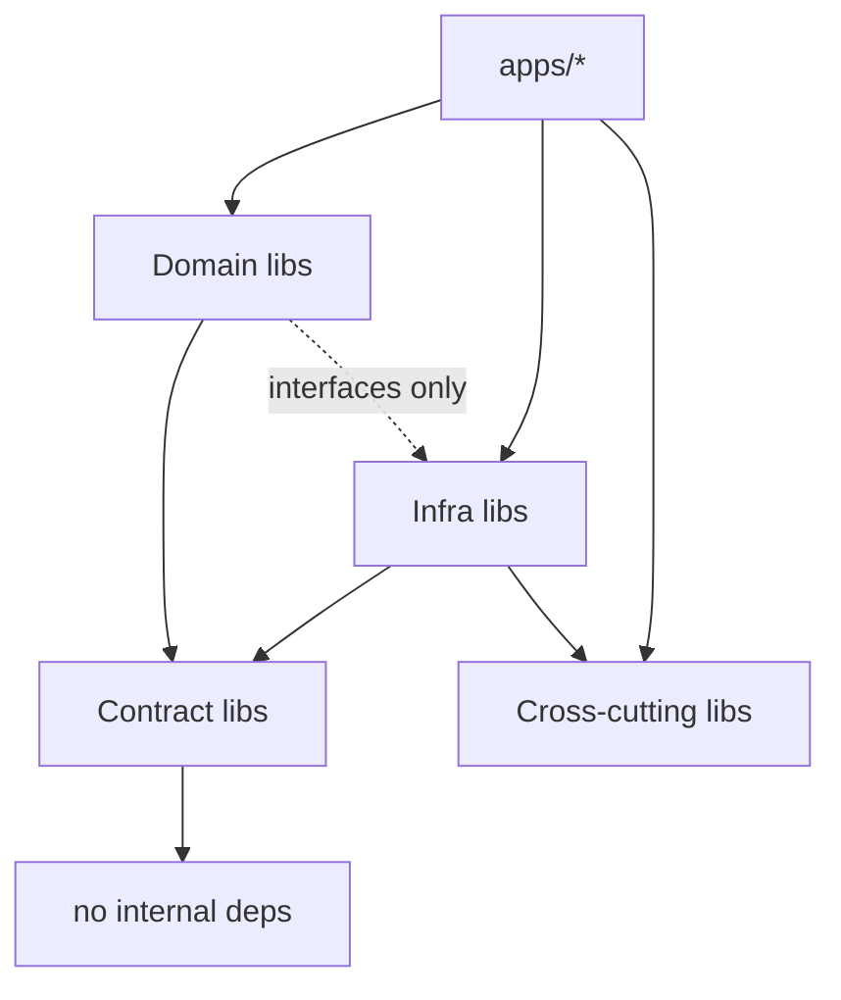

# Low-Level Design

This document describes module-level structure, key interfaces, and the
dependency rules that keep the codebase maintainable and testable.

## Layering and Dependency Rules



Allowed dependency directions (enforced via Nx tags + ESLint
`@nx/enforce-module-boundaries`):

- `type:app` may depend on `type:domain`, `type:infra`, `type:cross`, `type:contract`.
- `type:domain` may depend on other `type:domain` libs, `type:contract`, and
  `type:cross`. It must not import infrastructure libraries directly; it depends
  on ports (interfaces) it declares and that infra implements.
- `type:infra` may depend on `type:domain` (to implement domain ports),
  `type:contract`, and `type:cross`.
- `type:contract` (`shared-types`, `events`) must have no internal dependencies.
- `type:cross` (`config`, `observability`) may depend on `type:contract` only.

## Ports and Adapters

Domain libraries declare ports; infrastructure libraries provide adapters.

```ts
// libs/embedding - port
export interface EmbeddingProvider {
  readonly model: string;
  readonly dimensions: number;
  embed(text: string): Promise<number[]>;
  embedBatch(texts: string[]): Promise<number[][]>;
}
```

```ts
// libs/memory-core - repository port (implemented in libs/postgres)
export interface MemoryRepository {
  insert(memory: NewMemory): Promise<Memory>;
  findById(id: MemoryId): Promise<Memory | null>;
  listByUser(userId: UserId, opts: ListOptions): Promise<Memory[]>;
  softDelete(id: MemoryId): Promise<void>;
  setImportance(id: MemoryId, score: number): Promise<void>;
}
```

```ts
// libs/retrieval-core - vector search port
export interface VectorSearchPort {
  search(params: { userId: UserId; embedding: number[]; limit: number }): Promise<VectorMatch[]>;
}
```

The dependency-inversion boundary means domain use cases are unit-testable with
in-memory fakes from `libs/testing` and require no database or network.

## Key Domain Types

```ts
// libs/shared-types
export type MemoryType = 'working' | 'episodic' | 'semantic';
export type MemoryStatus = 'pending' | 'active' | 'archived' | 'deleted';

export interface MemoryDTO {
  id: string;
  userId: string;
  type: MemoryType;
  content: string;
  importance: number;
  status: MemoryStatus;
  metadata: Record<string, unknown>;
  createdAt: string;
  updatedAt: string;
}
```

## API Module Structure (NestJS)

```text
apps/api/src/
  main.ts                 // bootstrap Fastify + OTel + graceful shutdown
  app.module.ts           // root module composition
  health/                 // liveness/readiness controllers
  memories/
    memories.controller.ts
    memories.module.ts
    dto/                  // request/response DTOs + validation
  users/
    users.controller.ts
    users.module.ts
```

Controllers are thin: they validate input, resolve the principal from
`libs/auth`, call a use case from `libs/memory-core` or `libs/retrieval-core`,
and map the result to a response DTO. No SQL, no Kafka client, no ranking math
lives in controllers.

## Use Case Pattern

Each domain operation is a use case class with a single `execute` method and
constructor-injected ports:

```ts
export class CreateMemoryUseCase {
  constructor(
    private readonly memories: MemoryRepository,
    private readonly events: EventPublisher,
    private readonly clock: Clock,
  ) {}

  async execute(input: CreateMemoryInput): Promise<MemoryDTO> {
    const memory = await this.memories.insert({
      userId: input.userId,
      type: input.type,
      content: input.content,
      status: 'pending',
      createdAt: this.clock.now(),
    });
    await this.events.publish(MemoryCreated.from(memory));
    return toMemoryDTO(memory);
  }
}
```

This keeps business rules pure, deterministic (injected `Clock`), and trivially
unit-testable.

## Worker Structure

Every worker follows the same skeleton to maximize consistency:

```text
consume(event)
  -> validate payload (events schema)
  -> check idempotency key (processed?)
  -> call domain use case
  -> persist result
  -> publish follow-up event
  -> commit offset
on error -> retry topic (bounded) -> DLQ
```

See `event-driven-design.md` for retry/DLQ specifics.

## Error Handling

- Domain errors are typed (`MemoryNotFoundError`, `ValidationError`) and mapped
  to HTTP status codes in a Nest exception filter.
- Infrastructure errors are wrapped to avoid leaking driver-specific details.
- All errors are logged with correlation IDs (see `observability-design.md`).

## Configuration

`libs/config` parses and validates `process.env` once at startup using a schema.
Invalid configuration fails fast (process exits) rather than failing lazily at
first use.

```ts
export interface AppConfig {
  nodeEnv: 'development' | 'test' | 'production';
  http: { host: string; port: number };
  postgres: { url: string; poolSize: number };
  redis: { url: string };
  kafka: { brokers: string[]; clientId: string; groupId: string };
  embedding: { provider: 'openai' | 'mock'; model: string; dimensions: number };
  otel: { exporterUrl: string; serviceName: string };
}
```

## Testing Strategy

- **Unit tests** cover domain use cases and ranking with in-memory fakes.
- **Integration tests** cover repositories and workers against Dockerized
  Postgres/Redis/Kafka.
- **Contract tests** assert event payloads match the schemas in `libs/events`.
- `libs/testing` provides builders (e.g. `aMemory()`), fakes (in-memory repos),
  and harnesses for spinning up infra in integration tests.
