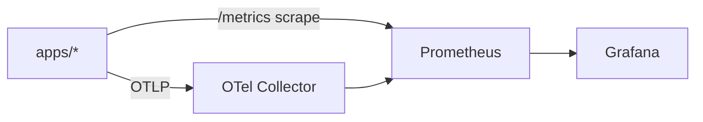
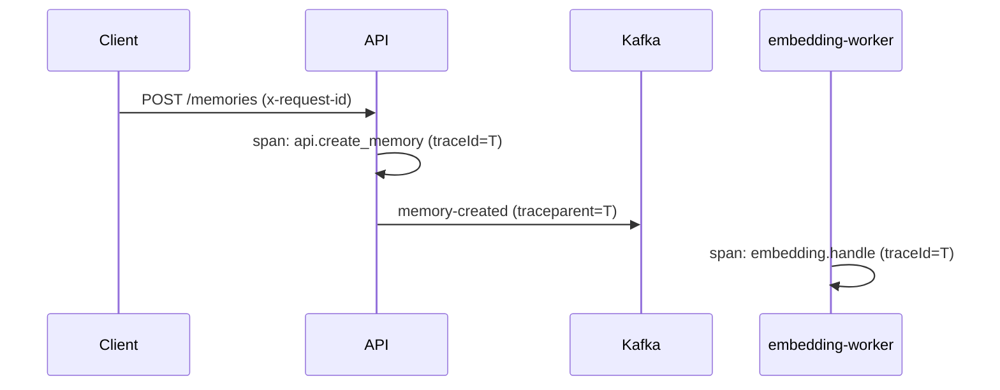

# Observability Design

Observability is a first-class concern, wired in from the start rather than
bolted on. Three pillars: structured logs, metrics, and distributed traces, all
correlated by trace and request identifiers.

## Stack

| Pillar  | Tooling                                                 |
| ------- | ------------------------------------------------------- |
| Logs    | Structured JSON logger (pino), shipped to stdout        |
| Metrics | Prometheus client + scrape endpoint, Grafana dashboards |
| Traces  | OpenTelemetry SDK + OTLP exporter to the OTel Collector |

`libs/observability` centralizes setup so every app initializes telemetry the
same way.

## Local Topology



Defined in `infra/docker` plus config under `infra/prometheus`,
`infra/grafana`, and `infra/otel`.

## Logging

- JSON lines, one event per line, to stdout (collected by the platform).
- Every log includes: `timestamp`, `level`, `service`, `traceId`, `spanId`,
  `requestId` (HTTP) or `eventId` (workers), and `message`.
- No secrets or full memory content at `info` level; content is logged only at
  `debug` and is redactable.

```ts
logger.info({ requestId, userId, memoryId }, 'memory created');
```

## Correlation

- The API assigns a `requestId` per request (or honors inbound
  `x-request-id`) and starts an OpenTelemetry span.
- The `traceId` propagates to Kafka via envelope metadata so a memory can be
  followed from HTTP request through embedding/scoring workers.



## Metrics

Prometheus metrics exposed at `/metrics` on each app.

| Metric                          | Type      | Labels                      | Meaning                                  |
| ------------------------------- | --------- | --------------------------- | ---------------------------------------- |
| `retrieval_latency_seconds`     | histogram | `cache_hit`                 | End-to-end retrieval time                |
| `embedding_duration_seconds`    | histogram | `provider`, `model`         | Time to embed                            |
| `cache_hit_rate`                | derived   | -                           | Hits / (hits + misses) for context cache |
| `context_cache_events_total`    | counter   | `result` (hit/miss)         | Cache outcomes                           |
| `memory_count`                  | gauge     | `type`                      | Memories by type                         |
| `kafka_consumer_lag`            | gauge     | `topic`, `group`            | Consumer lag                             |
| `events_processed_total`        | counter   | `topic`, `status`           | Worker throughput                        |
| `events_dlq_total`              | counter   | `topic`                     | Messages sent to DLQ                     |
| `http_requests_total`           | counter   | `route`, `method`, `status` | HTTP traffic                             |
| `http_request_duration_seconds` | histogram | `route`, `method`           | HTTP latency                             |

## Tracing

- OpenTelemetry auto-instrumentation for HTTP, Fastify, and the Postgres/Redis
  clients where supported.
- Manual spans for domain operations: `api.create_memory`,
  `retrieval.search`, `embedding.handle`, `importance.handle`.
- Exported via OTLP to the Collector, which can fan out to a tracing backend
  (Jaeger/Tempo) in addition to Prometheus for span metrics.

## Health and Readiness

Each app exposes:

- `GET /health/live` - process is up (always 200 if event loop responsive).
- `GET /health/ready` - dependencies reachable (Postgres, Redis, Kafka as
  applicable). Returns 503 until dependencies are ready, so orchestrators can
  gate traffic.

## Dashboards

Grafana dashboards are provisioned from `infra/grafana` and cover:

- **API overview**: request rate, error rate, latency percentiles.
- **Retrieval**: latency histogram, cache hit rate.
- **Workers**: throughput, processing latency, DLQ counts, consumer lag.
- **Infra**: Postgres connections, Redis ops, Kafka lag.

## Alerting (future)

Prometheus alert rules (documented, enabled in production) for: elevated error
rate, retrieval p95 breach, growing consumer lag, and DLQ growth.
