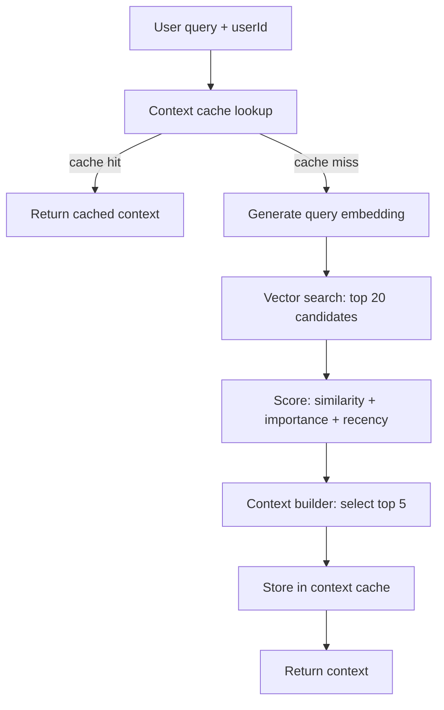

# Retrieval Pipeline Design

Retrieval is the heart of the system and the most latency-sensitive path. It is
fully synchronous and must never depend on Kafka. It lives in
`libs/retrieval-core` and is invoked by the API endpoint
`POST /memories/context`.

## Goals

- Low p95 latency (cache-first).
- Relevant results combining semantic similarity, importance, and recency.
- Deterministic, unit-testable ranking.

## Pipeline



## Steps

1. **Cache lookup.** Key: `context:{userId}:{hash(query)}`. On hit, return
   immediately. This bounds latency for repeated/similar queries.
2. **Query embedding.** Use the configured `EmbeddingProvider` to embed the query
   text. In tests, a deterministic mock provider is used.
3. **Vector search.** pgvector cosine search scoped to the user's active,
   non-deleted memories, returning the top 20 candidates with raw similarity.
4. **Ranking.** Combine signals via `libs/ranking` (pure functions).
5. **Context building.** Take the top 5 ranked memories, deduplicate
   near-identical content, and assemble the response context array.
6. **Cache store.** Persist the result with a short TTL (default 60s) to absorb
   bursts without serving stale context for long.

## Ranking Formula

Implemented as pure functions in `libs/ranking`:

```text
finalScore =
    semanticSimilarity * 0.7
  + normalizedImportance * 0.2
  + recencyScore * 0.1
```

Where:

- `semanticSimilarity` in [0, 1] = `1 - cosineDistance`.
- `normalizedImportance` = `clamp(importance, 0, 10) / 10`.
- `recencyScore` = exponential decay on age:
  `exp(-ageDays / halfLifeDays)` with a configurable half-life (default 30 days).

```ts
export function recencyScore(ageDays: number, halfLifeDays = 30): number {
  return Math.exp(-ageDays / halfLifeDays);
}

export function finalScore(
  input: {
    similarity: number;
    importance: number;
    ageDays: number;
  },
  weights = { similarity: 0.7, importance: 0.2, recency: 0.1 },
): number {
  const normImportance = Math.min(Math.max(input.importance, 0), 10) / 10;
  return (
    input.similarity * weights.similarity +
    normImportance * weights.importance +
    recencyScore(input.ageDays) * weights.recency
  );
}
```

Weights are injectable so they can be tuned or A/B tested without touching call
sites.

## Response Shape

```json
{
  "context": ["Learning Kafka", "Building Memory Service", "Using Elasticsearch"],
  "items": [{ "memoryId": "...", "content": "Learning Kafka", "score": 0.83 }]
}
```

The flat `context` array is convenient for prompt assembly; `items` carries
scores and ids for debugging and evaluation.

## Caching Strategy

| Cache          | Key                            | TTL | Invalidation                                  |
| -------------- | ------------------------------ | --- | --------------------------------------------- |
| Working memory | `session:{sessionId}`          | 24h | TTL + explicit clear                          |
| Context cache  | `context:{userId}:{queryHash}` | 60s | TTL; best-effort purge on new memory for user |

Context cache is intentionally short-lived because new memories change relevant
context quickly. On `memory-created` the API may best-effort delete
`context:{userId}:*` to avoid serving stale context.

## Failure Handling

- **Embedding provider down**: retrieval fails fast with a 503; it does not fall
  back to keyword search in v1 (documented limitation). The mock provider keeps
  tests and local dev unaffected.
- **No embeddings yet**: brand-new memories may not be embedded at query time
  (embedding is async). Retrieval works on whatever is embedded; this is an
  accepted eventual-consistency tradeoff.
- **Cache unavailable**: retrieval proceeds without cache (degraded latency, full
  correctness).

## Performance Targets (initial)

- Cache hit: < 10ms server time.
- Cache miss: dominated by embedding + vector search; target p95 < 250ms with the
  mock/local provider and warm pgvector index.

Latency is measured via the `retrieval_latency` histogram (see
`observability-design.md`).
